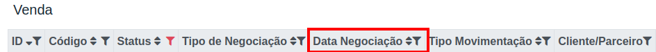
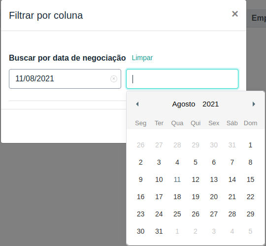
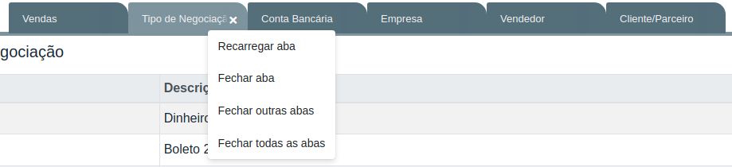
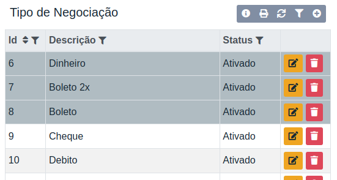
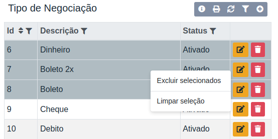
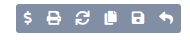

# 🧭 Guias

Nesta seção você encontra o passo a passo necessário para você realizar suas vendas, cadastrar seus usuários e vendedores, gerenciar seus ganhos e controlar seu financeiro.

### Dicas de uso

Para melhor operar as páginas e recursos oferecidos pelo Gestão Online, recomendamos a leitura desta seção para elucidar conceitos importantes, como a estrutura das páginas, o cadastro de novos items, seleção por filtro e atalhos.

#### Como o sistema funciona?

Como você verá, a maioria das páginas é uma tabela com:

- Os itens relacionados a aba (venda, clientes, contas).
- Filtros para cada uma das colunas.
- Opções para editar, remover e adicionar novos itens.
- Opções gerais em um menu no canto superior direito como:
  - Atualizar tabela.
  - Informação sobre a página.
  - Operações como realizar venda para o cliente aberto, abrir nova aba para modificar o item aberto...
  - Dependendo da página haverá opções para gerar relatórios, que são essenciais para a gestão do seu negócio.

Conhecendo este padrão, você irá se familiarizar e operar o sistema com mais facilidade e eficiência.

### Filtragem das Tabelas

Após abrir uma nova aba, você pode se deparar com a seguinte situação.

E se eu quiser ver somente os itens de um determinado período?

Para fazer isso é bem simples, de acordo com a página em aberto, haverá duas formas de fazer a filtragem, a primeira diretamente através da coluna relacionada a data, a segunda através do menu no canto superior direito clicando sobre o ícone de funil.

**Exemplo da página de vendas:**

Selecionando o filtro pela coluna:

Adicionando parâmetros:

### Atalhos

Para facilitar o seu dia a dia, o Gestão Online possui uma série de atalhos que você pode utlizar para facilitar as suas operações.

Para editar um item em específico sem precisar clicar sobre o ícone de edição, clique com o botão direito do mouse sobre a linha.

Caso precise realizar alguma ação sobre alguma aba, clique com o botão direito do mouse sobre ela. 

Para selecionar um determinado número de linhas, segure o botão **Ctrl** e clique sobre as linhas que deseja selecionar.

Após selecioná-las, clique com o botão direito do mouse sobre as linhas.

Realizar venda para cliente em edição.
Para abrir o cadastro de uma nova venda com o cliente já preenchido, selecione o ícone de **$** no menu superior direito ao editar o cliente.

