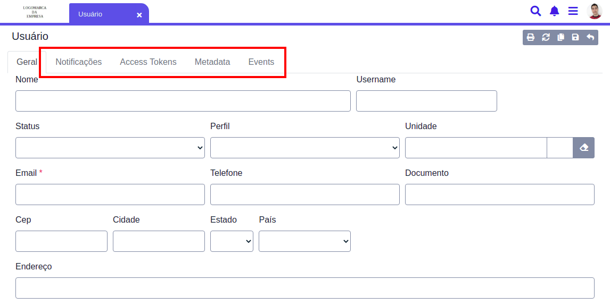

# Cadastro de Usuario

Estes serão os responsáveis pelo gerenciamento do seu sistema, podem gerar relatórios ou alterar certas informações de acordo com seu perfil de acesso.

Para cadastrar um novo usuário pesquise pela página **`Usuário`** no ícone de pesquisa.

Após abrir clique no ícone de `Adicionar Item`, um formulário será aberto solicitando os dados para adicionar o usuário.

Assim que preencher os dados basta clicar em **`Salvar`**, agora o cliente está cadastrado.

## Perfis de Acesso

O perfil de acesso define o papel um usuário no sistema.

* **User** : Esse usuário terá acesso básico ao sistema, é responsável pelo cadastro de clientes, realizar vendas e gerar relatórios.
* **Coordenador** : Além das permissões de usuário, este possui acesso ao financeiro e aos dashboards de sua unidade.
* **Manager** : Também pode visualizar os relatórios financeiros de outras unidades, cadastrar vendedores \(porém não pode apagá-los\) e cadastrar novos usuários com o perfil `User`.
* **Admin** : Possui acesso á maioria das funcionalidades, pode cadastrar novos usuários como Admin ou User, visualizar o histórico de todas as unidades, alterar ou remover vendedores/usuários ou clientes, alterar entradas no financeiro, cadastrar tabelas de preço e alterar detalhes em formas de pagamento, tipos de negociação e contas bancárias.
* **Superadmin** : Este perfil tem acesso **total** ao sistema e também pode realizar alterações em eventos e geração de relatórios em páginas como **`Notification Template`** e **`Reports and Widgets`**.


**Cuidado!** Por medidas de segurança, o **username** e **email** de um usuário não podem ser alterados manualmente após a sua inserção, para isso você deve solicitar a nossa equipe para que façamos as modificações necessárias.


## Metadados

Ao editar um usuário você se depará com algumas abas, \(Notificações, Access Tokens, Metadata e Events\), estas nada mais são que metadados relacionados ao usuário, os quais são utilizados para acesso, notificações, eventos ou foto de perfil.

