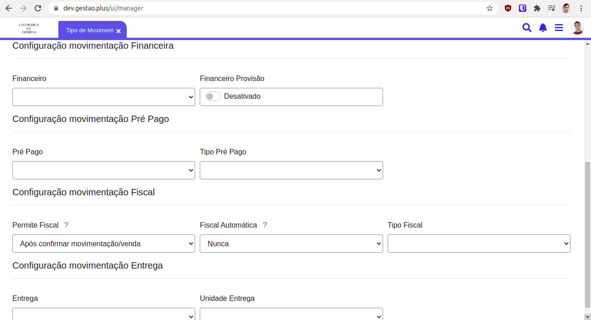
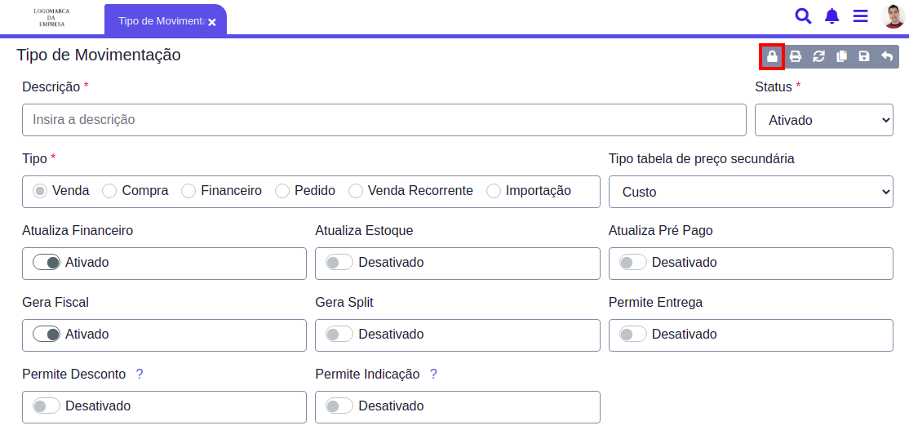

# Tipos de Movimentação

Com o Gestão Online é possível definir o comportamento de cada movimentação financeira no sistema, com a flexibilidade e controle que a sua empresa precisa.

Os tipos de movimentação podem ser usados para:

_Definir o comportamento das entradas no **Financeiro**._ Controlar as mudanças feitas por cada venda no sistema. \_ Configurar como o sistema irá operar caso seja utilizado o pré pago ou pós pago.

Através dos tipos de movimentação você poderá definir se uma venda irá:

* Alterar Financeiro
* Atualizar Estoque
* Atualizar Pré Pago
* Gerar Fiscal
* Gerar Split de Pagamento
* Permitir Entrega \(Caso a venda possua integração com outro sistema\)
* Permite Desconto
* Permite Indicação

Para definir um tipo de movimentação busque pela página, **`Tipo de Movimentação`**.

Aqui serão listados os tipos de movimentação, além de editá\_los ou excluí\_los, você também pode adicionar novos tipos, para isso selecione a opção **`Adicionar item`**.

Um formulário será aberto, solicitando as informações do tipo de movimentação a ser adicionado. Mais campos aparecerão de acordo com o **Tipo** selecionado.

Cada uma dessas opções irá determinar se alguma ação deve ser realizada ou não no sistema:

* **Alterar Financeiro**:

  Essa opção permite que uma venda que utilize esse tipo de movimentação gere novas entradas no financeiro de suas parcelas.

* **Atualizar Estoque**:

  Permite que a venda altere a quantidade de itens no estoque.

* **Atualizar Pré Pago**

  Permite que a venda reaize novas entradas na página _`Controle Pré Pago`_

* **Gerar Fiscal**

  Com a opção ativa, uma opção surgirá após a confirmação das vendas para a geração de notas fiscais.

* **Gerar Split de Pagamento**

  _`Em breve...`_

* **Permitir Entrega** \(Caso a venda possua integração com outro sistema\)

  Esta opção habilita a geração do código de venda, este pode ser usado através de algum sistema externo para consultar as informações da venda.

* **Permite Desconto**

  Caso esta opção esteja desabilitada, os vendedores não podem liberar desconto.

* **Permite Indicação**

  Permite a venda com indicações e comissionamentos, parceiro indicador \_&gt; cliente.

Conforme as opções forem sendo ativadas, novos campos surgirão.

## Restrições de Uso

Para restringir o uso de algum tipo de movimentação, selecione a opção **Restrições/Exceções**.

Um formulário será aberto solicitando os filtros que deseja aplicar para definir quem ou em que circunstâncias o tipo de movimentação em edição deverá ser utilizado.

